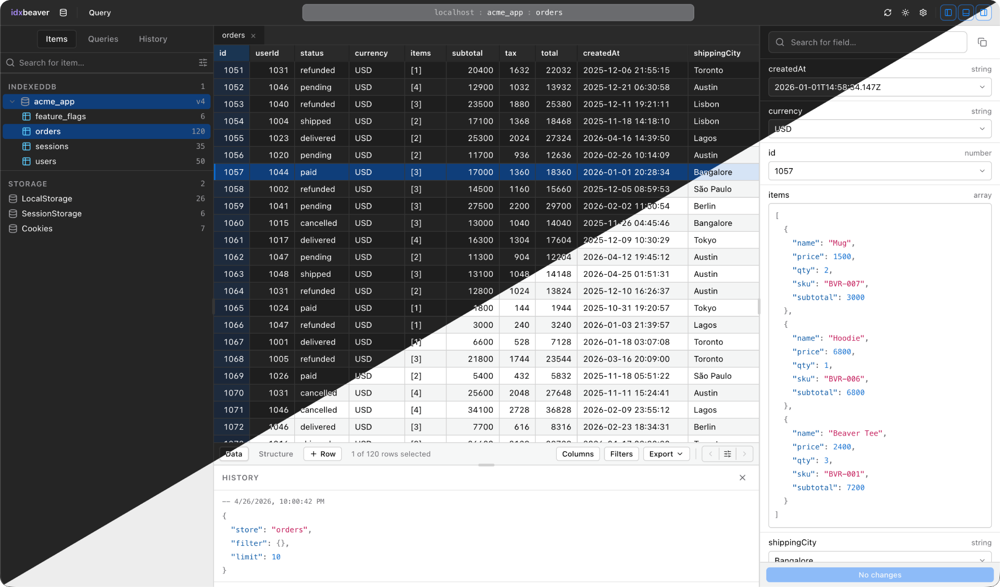

<div align="center">

# IdxBeaver

**A TablePlus-style database client for browser storage, inside Chrome DevTools.**

Browse, query, edit, and export IndexedDB, LocalStorage, SessionStorage, Cookies, and Cache Storage — with a proper data grid, a MongoDB-style query language, row inspector, and saved queries / history.



</div>

---

## Why

Chrome's built-in Application panel treats browser storage as an afterthought: no filtering, no schema awareness, no bulk edits, no query history, no exports that survive a page refresh. IdxBeaver turns it into the workflow you already use with a real database client.

## Features

- **IndexedDB browser** — discover every database and object store on every frame of the origin; inspect records in a zebra-striped grid with column pinning, resize, and sticky headers.
- **MongoDB-style queries** — filter, project, sort, limit. Index-aware plan selection under the hood, in-memory filter fallback for compound operators. Query plan surfaced in the UI.
- **Row inspector** — per-field editor with type indicators, inline NULL handling, and syntax-highlighted nested JSON.
- **Query history + saved queries** — auto-recorded per origin (last 100). Star the ones worth keeping.
- **LocalStorage, SessionStorage, Cookies, Cache Storage** — browse, add, edit, delete, clear.
- **Bulk import / export** — NDJSON, CSV, SQL `INSERT`, and ZIP snapshots. Round-trips non-JSON types (`Date`, `BigInt`, `Map`, `Set`, `Blob`, `ArrayBuffer`).
- **Schema inference** — samples up to 500 rows per store, drives autocomplete and the Structure view. One-click TypeScript / Dexie schema export.
- **Snapshots + diffs** — take a snapshot of a store or database, restore or diff against it later.
- **Command palette** — `⌘K` to jump between stores, tabs, saved queries, and actions.
- **Multi-origin, multi-frame** — IndexedDB is partitioned per origin; IdxBeaver follows the partitioning and labels sources correctly.
- **Dark + light themes** — pixel-aligned with TablePlus conventions; fonts, sizes, and table font (mono or sans) configurable from Settings.

## Install from zip

For most users — no build step.

1. Download the latest `idxbeaver-*.zip` from the [Releases](https://github.com/adityaongit/idxbeaver/releases/latest) page.
2. Unzip it somewhere permanent (don't delete the folder afterwards — Chrome loads from it).
3. Open `chrome://extensions`.
4. Enable **Developer mode** (top right).
5. Click **Load unpacked** → select the unzipped folder.
6. Open DevTools on any page → pick the **IdxBeaver** panel.

To update, download the new zip, replace the folder contents, and click **Reload** on the extension card.

## Install from source

For contributors and anyone who wants to build locally.

```bash
git clone https://github.com/adityaongit/idxbeaver.git
cd idxbeaver
npm install
npm run build
```

1. Open `chrome://extensions`.
2. Enable **Developer mode** (top right).
3. Click **Load unpacked** → select the `dist/` directory.
4. Open DevTools on any page → pick the **IdxBeaver** panel.

Reload the extension after each `npm run build` while developing.

## Preview without Chrome

For UI iteration that doesn't need real Chrome DevTools APIs:

```bash
npm run dev
```

(CRXJS serves the extension in dev mode — load `dist/` as unpacked and the panel hot-reloads on edits.)

## Querying

The query editor accepts a JSON document with the following shape:

```jsonc
{
  "store": "contextDB",
  "filter": { "contextProvider": "fireflies", "id": { "$gt": 10 } },
  "project": ["id", "contextType", "createdAt"],
  "sort": { "createdAt": -1 },
  "limit": 50
}
```

Supported filter operators: `$eq`, `$ne`, `$gt`, `$gte`, `$lt`, `$lte`, `$in`, `$nin`, `$exists`, `$regex`, `$and`, `$or`, `$not`. Index-backed equality and range queries are detected automatically and reported in the plan strip below the editor.

## Keyboard Shortcuts

| Action                    | Shortcut       |
| ------------------------- | -------------- |
| Open command palette      | `⌘K` / `Ctrl+K`|
| Run query                 | `⌘↵` / `Ctrl+↵`|
| Save query                | `⌘S` / `Ctrl+S`|
| Toggle left / bottom / right panel | Buttons in topbar |
| Commit cell edit          | `↵`            |
| Cancel cell edit          | `Esc`          |

## Architecture

Three-process Manifest V3 extension:

```
 DevTools panel  (React + Tailwind v4 + CodeMirror)
        │  chrome.runtime port  (typed StorageRequest / StorageResponse)
        ▼
 Service worker  (src/background/index.ts)
        │  chrome.scripting.executeScript (world: MAIN)
        ▼
 Inspected page  (injected cursor loop, Mongo-style matcher, serializer)
```

See [`CLAUDE.md`](CLAUDE.md) for a deeper walkthrough — shared types, key files, and the serialization boundary.

## Development

```bash
npm run build         # type-check + bundle
npm run build:watch   # watch mode (no type-check)
npm test              # vitest
npm run test:watch
npx vitest run src/shared/query.test.ts   # single test file
```

## Project Tracking

[`docs/PROJECT_BOARD.md`](docs/PROJECT_BOARD.md) is the durable task board. [`docs/BUGS.md`](docs/BUGS.md) tracks known deferred issues with code references.

## License

Private / unreleased. Ask before redistributing.
