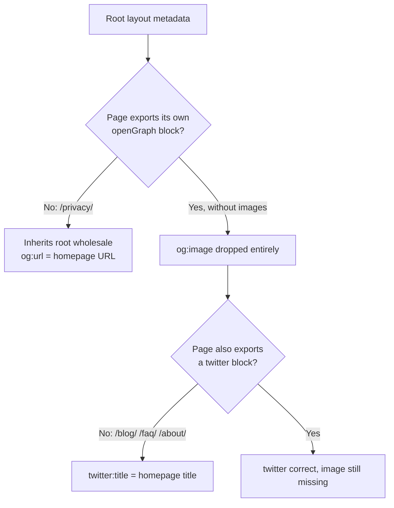

# SEO and frontend fixes applied

Date: 2026-09-09
Scope: `landing-site/`
Verified by: `npm run build` plus an assertion pass over the generated `out/` HTML.

Companion documents: `FULL-AUDIT-REPORT.md` (findings), `ACTION-PLAN.md` (the plan
these fixes came from), `findings/` (per-specialist detail).

## Findings discovered while implementing, not in the original audit

Three of these only surfaced once the build output was inspected directly. They
matter more than several of the audited items.

1. **The emitted `og:image` URL 308-redirected.** Next's file-convention OG image
   is referenced as `/opengraph-image?<hash>`, and `trailingSlash: true` makes
   that path redirect. Only `/opengraph-image/` returned 200.
2. **It was served as `application/octet-stream`.** The exported file has no
   extension, so a static host cannot infer a type. Strict social scrapers reject
   a non-image content type.
3. **The file convention outranked the metadata object.** Setting
   `openGraph.images` in the root layout did not win on the homepage; the
   convention's own tag did. So the most-shared page kept the broken URL even
   after the metadata fix.

Fix for all three: the image is now generated by an explicit route at
`src/app/og.png/route.tsx`, which emits a real `out/og.png` with a correct content
type and no redirect. `src/app/opengraph-image.tsx` was removed so the convention
no longer injects a competing tag.

## The metadata merge bug

One mistake produced three separately-reported symptoms. Next's `Metadata` merges
per top-level key, not deeply.

Fixed at the root rather than per page: every page now builds its metadata through
`pageMetadata()` in `src/lib/seo.ts`, which always sets canonical, `og:url`,
`og:image`, and a matching `twitter` card from one input. The trap cannot be
re-entered by adding a page.

## SEO fixes

| Finding | Severity | Fix |
|---|---|---|
| `aggregateRating` with no visible rating content | Critical | Removed from `layout.tsx`. A comment records why, so it is not reinstated without a visible sourced ratings block. |
| Render-blocking Google Fonts stylesheet, 907-1050ms/page | Critical | `Google_Sans` now self-hosted via `next/font/google`, `subsets: ["latin"]`, weights 400/500. The CDN endpoint was serving a `@font-face` block for every unicode subset it knows (armenian, bengali, devanagari, and more) to style two button labels. |
| No `og:image` on any inner page | High | `pageMetadata()` sets it everywhere; verified on all 13 pages. |
| `twitter:*` showing homepage values on `/blog/`, `/faq/`, `/about/` | High | Same helper. |
| `/privacy/` `og:url` pointing at the homepage | High | Same helper. |
| Article/BlogPosting missing required `image` | High | Added in `blog-post.tsx` and both `/vs/` pages. |
| No `WebSite` entity, no `@id` graph | High | New `src/lib/entities.ts` emits Organization, WebSite and Person in one `@graph` with stable `@id`s, referenced by `@id` from every `publisher` and `author`. |
| `publisher` a bare Organization stub | Medium | Organization now carries `url`, `logo`, `founder`, `sameAs`. |
| Breadcrumb URLs lacked trailing slashes | Medium | `buildBreadcrumbJsonLd` routes paths through `withSlash()`. |
| 6 internal hrefs forcing 308s | Medium | All slashed, including the nav and footer link arrays. |
| `dateModified` frozen equal to `datePublished` | Low | `BlogPost.updatedOn` drives it via `postLastModified()`. |
| Shared build-time `lastmod` on 6 of 9 URLs | Medium | `PAGE_LAST_MODIFIED` map in `sitemap.ts`; 4 distinct dates now emitted. |
| Two titles over 60 chars, one description at 218 | Medium | All 13 titles now ≤ 58 chars, all descriptions ≤ 163. |
| Inert `keywords` meta, `changefreq`/`priority` | Low | Removed. |
| Product definition only on `/faq/` | Low | Entity-anchored opening sentence now on the homepage hero and a new `/about/` section. |
| `llms.txt` linked the redirecting `/privacy` | Low | Slashed, plus Guides, Comparisons and Notable facts sections. |

## Content added

| Page | Why |
|---|---|
| `/blog/how-to-edit-indexeddb-values-in-chrome/` | The `edit indexeddb chrome devtools` SERP is entirely workaround content for the limitation this product removes, and the site had no page for it. Leads with the honest Console and Snippet workarounds before the product. |
| `/blog/exporting-indexeddb-data/` | SERP-confirmed separate cluster with zero prior coverage; maps to a shipped feature. |
| `/blog/browser-storage-types-explained/` | The homepage already claimed LocalStorage, Cookies and Cache Storage scope with no content behind it. |
| `/vs/indexeddb-viewer-extensions/` | Competitor comparison against IndexedDB Browser, idb-crud, IndexedDB Explorer and IndexedDBEdit. |

Claims about competitors were taken from their public READMEs and Chrome Web Store
listings and are dated on the page. Capabilities absent from those sources are
marked "Not documented" rather than "no", and the page carries a genuine "when not
to use IdxBeaver" section. The strongest verified differentiator is that IndexedDB
Browser's own README documents sets, maps and typed arrays as unsupported and warns
about large stores.

Internal linking was the real cluster problem, not missing pages: `/vs/` and the
query post each contained exactly one href, an external one. Both now link the
pillar and siblings, and every post carries a Related reading block.

The query post also gained a native-API primer as its first section. Real SERP data
for `query indexeddb` is MDN, W3C, web.dev and javascript.info, so leading with a
proprietary filter syntax answered a question the searcher had not asked yet.

## Frontend fixes

From `web-design-guidelines`, `make-interfaces-feel-better` and `impeccable audit`.

| Finding | Severity | Fix |
|---|---|---|
| `--color-ink-mute` at 3.45:1 used for 11-13.5px text | P1, WCAG AA | Raised to `#747881`, 4.50:1. The whole text ramp now passes AA on every surface. |
| `--color-ink-faint` at 1.94:1 carrying real text | P1, WCAG AA | Footer copyright and code line numbers moved to `ink-mute`. The token stays for decorative dots and mock-UI chrome, with a comment stating it must not carry text. |
| No `color-scheme` declared on a dark site | P2 | `color-scheme: dark` on `html`, plus a `Viewport` export with `colorScheme` and `themeColor`. Native scrollbars, form controls and select popups now render dark. |
| Sticky nav covered anchor targets | P2 | `scroll-padding-top: 76px` on `html`. |
| No skip link | P2 | Added, with `id="main-content"` on both `main` landmarks. |
| Focus ring nearly invisible on dark | P2 | Explicit `:focus-visible` outline in the brand color. |
| `transition: all` in two components | P3 | Replaced with explicit property lists. |
| Two icon buttons at 34x34 | P2 | Raised to 40x40. |
| Drawer missing scroll containment | P3 | `overscroll-contain`. |
| No `text-wrap` on headings or prose | P3 | `balance` on h1-h3, `pretty` on p. |
| Product screenshots eager-loaded below the fold | P3 | `loading="lazy"`, dropped `fetchPriority="high"`; neither is the LCP element. |
| Hero logo `alt` unreachable behind `aria-hidden` | P3 | Empty alt, matching the other decorative logo instances. |
| Figure radius off-system | P3 | `rounded-[14px]` to match every other large image surface, with a pure-white 10% outline. |
| Orphaned `public/screenshots/query.*` | Info | Now used on `/vs/` pages and the export post. |
| `/vs/` had no product screenshot | Medium | Both `/vs/` pages now embed product figures. |
| Screenshots served at 2940x1728 with no `srcset` | P2 | Three width steps per asset, `sizes` on every `<source>` and ``. |
| Code samples and the brand name exposed to auto-translate | P3 | `translate="no"` on the shiki wrapper, the two hand-rolled `<pre>` blocks, all 114 inline `<code>` spans, and the wordmark. |
| z-index picked ad hoc (`z-50`, `z-[60]`, `z-[100]`, `z-index: 100`) | P3 | Named scale in `:root`: `--z-atmos`, `--z-nav`, `--z-drawer`, `--z-grain`, `--z-skip`. |
| Heading ran together on mobile: "queries.Index-aware plans." | P2 | The ` ` is `hidden sm:block`, so below `sm` the two sentences had no separator. Added one. |

### Responsive images

Masters moved to `landing-site/assets/screenshots/`, outside `public/`, so the
2940px originals no longer ship. `npm run gen-screenshots` regenerates the served
steps with sharp:

| Asset | Steps | Why that ceiling |
|---|---|---|
| `dark`, `light` | 960, 1920, 2560 | The compare slider caps at 1256 CSS px, doubled for 2x displays. |
| `query` | 960, 1920 | Only appears in content figures, which cap at 920 CSS px. |

Verified in a real browser rather than by reading the markup: at 390px the content
figure loads `dark-960.avif`, at 1200px the slider loads `dark-1920.avif`. Every
emitted srcset URL is asserted to exist in `out/`.

`public/screenshots/` went from 3.30 MB to 1.33 MB, and the largest single file a
visitor can now be served is 189 KB instead of 736 KB.

### Verified as already correct

- `formatDate` in `blog/page.tsx` and `blog-post.tsx` uses
  `toLocaleDateString("en-US", { ... })`. Flagged during the audit as a hardcoded
  date format, which was wrong: it is the Intl formatter, and the fixed locale is
  what keeps the server and client renders identical. Left as-is.

- The compare slider is fully keyboard operable. Arrow keys, Home and End are
  handled, and `aria-valuenow` updates live. The handler is registered
  imperatively in the effect, which is why a JSX-attribute grep misses it.
- `prefers-reduced-motion` is handled in two thorough blocks covering every
  animated class.
- `-webkit-font-smoothing: antialiased` and `tabular-nums` were already present.
- Contrast for `ink`, `ink-2`, `ink-dim`, brand and accent all pass comfortably.

## Deliberate deviations from the skill rules

Flagged rather than changed, because each is a coherent existing design decision
and overriding it site-wide is the owner's call.

1. **Gradient text (`.ir`).** `impeccable` bans `background-clip: text` outright.
   Here it is used on exactly three words across the entire site, is documented as
   reserved for one or two key words, and is the brand's iridescent signature.
   Removing it would flatten the site's identity to satisfy a rule aimed at
   decorative overuse.
2. **Press feedback is `translate-y-px`, not `scale(0.96)`.** The skill prescribes
   the scale. The site uses a consistent physical-press idiom across every CTA.
   Changing it is a site-wide feel change, not a fix.
3. **`will-change: clip-path` on the compare slider.** The rule limits
   `will-change` to transform, opacity and filter. This is a 60fps pointer drag
   over `clip-path`, the one case where the hint is defensible. Left as-is.
4. **`FIG 0.x` section kickers.** These read as the banned per-section eyebrow,
   but they are a deliberate technical-drawing motif rather than generic
   `ABOUT / PROCESS` scaffolding.

## Known remaining items

- **Google Sans has no fallback metrics.** The build warns
  `Failed to find font override values for font 'Google Sans'`, so no `size-adjust`
  fallback is generated. The install button has a fixed height and a real fallback
  stack, so vertical shift is prevented, but a small horizontal reflow on that one
  button is possible when the font loads. Dropping the brand font for that label
  would remove it entirely.
- **Security headers are not fixable in this config.** `next.config.ts` sets
  `output: "export"`, so a `headers()` block is ignored. CSP,
  `X-Content-Type-Options`, `Referrer-Policy` and `X-Frame-Options` must be set at
  the host. Only HSTS is present today.
- **Per-page OG images.** All pages share one image. Per-post images would need a
  route per post.
- **The three original posts are still 641-777 words** against a 1,500-word floor
  for their type, and contain no images beyond the new Related reading blocks.
- **`aggregateRating` can return** once a visible, sourced ratings block exists
  on-page. The extension has roughly 200 users, so the underlying rating is real;
  the markup was removed because nothing on the site displayed it.
- **No `PRODUCT.md`**, which `impeccable` expects for its full flow, so the
  `impeccable` register step ran off the code rather than a stated brief.
- **`frontend-design:frontend-design` was never run.** It was one of the four
  skills requested; the other three were applied.
- **Roughly 100 em-dashes across site copy.** The house style forbids them.
  Changing them is a voice pass over nearly every page, not a fix, so it is left
  for a decision rather than done silently.

## frontend-design skill audit (2026-09-09)

Ran `frontend-design:frontend-design` against the built site, screenshotted in a
real browser rather than read from source. It flags one integrated pattern, not
five separate bugs: the site's whole visual identity kit matches its own list of
common AI-generated tells.

Confirmed on every page: a tracked-out ALL-CAPS mono eyebrow above every section
and every content-page h1 (`FIG 0.2 · PRODUCT`, `ABOUT`, `WRITING`), middle-dot
meta strings (`FIG 0.3 · QUERY`, `SEPTEMBER 9, 2026 · 9 MIN READ`), a `→`
appended to every card and button link (`Read post →`, `View on GitHub →`), and
a gradient-colored word or phrase as the sole headline accent (`client.`,
`we wanted.`).

This is not new: `.ir` gradient text and the `FIG 0.x` kickers were already
raised against `impeccable`'s stricter, narrower bans and kept as deliberate,
documented brand choices. `frontend-design` catches the same system from a
different angle and adds two instances `impeccable` does not check: the `→`
arrow links, and the footer's `PRODUCT` / `RESOURCES` / `PROJECT` all-caps
column headers.

Not changed. This is the second design skill in one session to name the same
system as a generic-AI default, which is worth weighing seriously, but it is
also the site's entire current identity applied consistently rather than
scattered inconsistently, and reversing it is a full visual-identity decision,
not a fix. Left for the owner's call.
