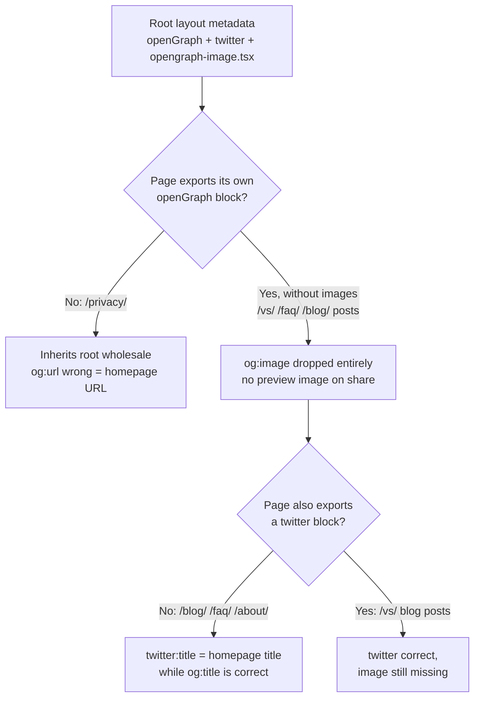

# SEO Audit: idxbeaver.portlabs.in

Date: 2026-09-09
Scope: 9 live URLs (whole site)
Business type: SaaS / developer tool (free MIT Chrome DevTools extension, no signup)

## SEO Health Score: 67 / 100

| Category | Score | Weight | Contribution |
|---|---|---|---|
| Technical SEO | 65 | 22% | 14.30 |
| Content Quality | 65 | 23% | 14.95 |
| On-Page SEO | 82 | 20% | 16.40 |
| Schema / Structured Data | 30 | 10% | 3.00 |
| Performance (CWV) | 80 | 10% | 8.00 |
| AI Search Readiness | 77 | 10% | 7.70 |
| Images | 60 | 5% | 3.00 |
| **Total** | | | **67.35 -> 67** |

Schema is the outlier dragging the score. It is also among the cheapest to fix.

### Data limitations, stated up front

- No Google API credentials, so there is no CrUX field data, no Search Console
  indexation or query data, and no GA4 traffic. Every performance number here is
  Lighthouse lab data under mobile throttling.
- Backlinks were limited to Common Crawl plus a link verifier. No DA/PA, no spam
  scoring, no discovery of unknown inbound links.
- Four of the eight target queries were SERP-checked; four were not.

## Executive summary

The site is technically well built. It is fully server-rendered, robots.txt is
clean and open to every AI crawler tested, the sitemap covers all 9 live pages
with no orphans, CLS is 0 and TBT is under 20ms everywhere, alt text is
descriptive, and every image ships an AVIF/WebP/PNG fallback chain. The product
claims on the site are also true, which is rarer than it sounds: the extension
source contains no fetch, XHR or analytics calls and no remote endpoints, so the
zero-telemetry promise holds, and the privacy page's permission list matches the
manifest exactly.

What holds it back is a small number of defects with outsized reach, plus one
large missed content opportunity.

### Top 5 issues

1. **`aggregateRating` in schema with no visible rating content on any page**
   (`src/app/layout.tsx:109-115`). Rating markup is injected sitewide; no page
   renders reviews or ratings. This is a structured-data policy violation and the
   one finding here that can trigger a manual action. Four of ten specialists
   flagged it independently.
2. **A render-blocking Google Fonts stylesheet costing 907-1050ms on every page**
   (`src/app/layout.tsx:77-81`), loaded to style two labels in one button
   (`cws-install-button.tsx:4`). It is the dominant cause of homepage LCP 4.38s.
3. **Inner pages ship no `og:image` at all.** Not a shared image, none. Any page
   that sets its own `openGraph` block without `images` drops the root
   file-convention image. `/vs/`, the high-intent comparison page, shares with no
   preview image.
4. **No security headers** beyond HSTS. No CSP, `X-Content-Type-Options`,
   `Referrer-Policy` or `X-Frame-Options` on any route.
5. **No page targets "edit indexeddb chrome devtools"**, the query whose SERP is
   made entirely of workarounds for the exact limitation this product removes.

### Top 5 quick wins

1. Move Google Sans to `next/font/google`. One file, recovers ~1s of LCP.
2. Delete the `aggregateRating` block. One deletion, removes the policy risk.
3. Add `twitter` and `openGraph.images` to the 4 page metadata exports that are
   missing them. One pass, fixes three separate reported symptoms.
4. Add security headers via `next.config.ts` `headers()`. One block.
5. Add contextual internal links from `/vs/` and the query post to the homepage.
   Two hrefs.

All five are under an hour of work in total and move four of the seven categories.

## The metadata merge bug, one root cause behind three findings

Next.js `Metadata` merges per top-level key, not deeply. A page that exports an
`openGraph` block without an `images` field, and no `twitter` block at all,
silently discards the root layout's OG image and inherits the root's entire
`twitter` object.

Verified live:

| URL | og:url | og:image | twitter:title |
|---|---|---|---|
| `/` | correct | present | correct |
| `/vs/...panel/` | correct | **missing** | correct |
| `/faq/` | correct | **missing** | **homepage's** |
| `/blog/debugging-.../` | correct | **missing** | correct |
| `/privacy/` | **homepage URL** | inherited | **homepage's** |

Fixing this is one editing pass across `src/app/{privacy,blog,faq,about}/page.tsx`
plus the `/vs/` and blog-post metadata, and it closes findings reported
separately by the technical, visual and schema specialists.

## Technical SEO (65/100)

Passing: HTTPS with HSTS, valid robots.txt declaring the sitemap, every page
server-rendered (`is_spa: false`), correct canonicals matching sitemap entries,
no hreflang needed for a single-market site, mobile viewport correct, no
horizontal overflow at 390px.

| Finding | Severity |
|---|---|
| No CSP, X-Content-Type-Options, Referrer-Policy, X-Frame-Options on any route | High |
| `/privacy/` inherits homepage OG wholesale including wrong `og:url` | High |
| `twitter:*` wrong on `/blog/`, `/faq/`, `/about/` (metadata merge) | High |
| 6 internal hrefs lack trailing slashes, forcing avoidable 308s | Medium |
| Render-blocking Google Fonts stylesheet sitewide | Medium |
| 2 titles over 60 chars, 1 meta description at 218 chars | Medium |
| Hardcoded `aggregateRating` is a manual-sync liability | Medium |

`/changelog/` and `/docs/` return 404 but are **not** defects. Both strings exist
only in `src/lib/demo-seed.ts:47-48` as fixture route names for the extension's
own IndexedDB demo data. Nothing on the site links to them.

The 6 non-canonical internal hrefs: `site-footer.tsx` (Privacy), `site-nav.tsx:142`
(About), `faq/page.tsx:182` and `:229`, `blog-post.tsx:53`,
`blog/debugging-indexeddb-in-chrome-devtools/page.tsx:174`.

## Content Quality (65/100) and On-Page SEO (82/100)

E-E-A-T sub-scores: Experience 85, Expertise 80, Trustworthiness 85,
Authoritativeness 55. Authoritativeness is the only weak axis, which is expected
for a solo-maintainer tool with no external validation yet.

Verified accurate claims, the site's real trust assets:

- Zero network calls: no fetch, XHR or analytics anywhere in the extension source;
  manifest declares no remote endpoints.
- Privacy page permission list matches `manifest` exactly.
- MIT license confirmed in `LICENSE`; SQL and ZIP export claims confirmed in
  `export.ts` / `import.ts`.

| Finding | Severity |
|---|---|
| All 3 blog posts 641-777 words against a 1,500-word floor for the type | Medium |
| `sitemap.ts:16` stamps build-time `lastmod` on 6 of 9 pages | Medium |
| `dateModified` hardcoded equal to `datePublished` on `/vs/` and all posts | Low |
| Batch-publish pattern: all non-home content dated 2026-04-29, never revised | Low |
| Legacy `keywords` meta array present (inert, hygiene only) | Low |

The `lastmod` defect produces a visible contradiction: `/privacy/` tells readers
"Last updated 2026-04-27" while the sitemap claims the current build time.

**Correction applied to this category.** The content specialist deducted 10
points from On-Page SEO for "live sitemap omits `/privacy/`, suspected deploy
drift". That came from an error in this audit's own initial recon, where a
truncated fetch cut the 9th sitemap entry. The live sitemap contains all 9 URLs
including `/privacy/`, confirmed by direct count. The deduction was removed and
On-Page SEO raised from 72 to 82.

## Schema / Structured Data (30/100)

The weakest category by a wide margin.

| Finding | Severity |
|---|---|
| `aggregateRating` (5.0, n=7) sitewide with no visible on-page rating content | **Critical** |
| All 4 Article/BlogPosting blocks missing required `image` | High |
| No `WebSite` entity, no `@id` graph, all entities disconnected | High |
| `publisher` is a bare `{"@type":"Organization","name":"IdxBeaver"}` stub | Medium |
| BreadcrumbList item URLs lack trailing slashes, point at redirecting URLs | Medium |
| `author.url` present on BlogPosting, absent on the `/vs/` Article | Low |
| FAQPage on `/faq/` | Info |

On the rating: the source comment at `layout.tsx:106-108` says the values come
from the Chrome Web Store listing and warns that stale values would be a
violation. The problem is more basic than staleness. Google requires rating
markup to reflect rating content visible on the page carrying the markup. No page
on this site renders any rating, review or testimonial. The only "review" strings
in the HTML are demo-grid fixture data. Either surface the Chrome Web Store
rating on-page with a link to its source, or remove the block.

On FAQPage: Google retired FAQ rich results for all sites on 2026-05-07, so this
markup has no SERP benefit, and any AI citation benefit is unconfirmed. It is
correctly typed (authored product FAQ, not user-submitted Q&A, so `QAPage` does
not apply) and costs nothing. No action, and no removal recommended.

Missing `image` on Article blocks blocks Article rich-result eligibility outright,
and it shares a root cause with the missing `og:image` finding: no per-post image
route exists.

## Performance (80/100, lab only)

Lighthouse mobile, simulated slow-4G with 4x CPU throttling.

| Page | Score | LCP | CLS | TBT | TTFB |
|---|---|---|---|---|---|
| `/` | 80 | **4.38s** (poor) | 0 | 19.5ms | 56ms |
| `/vs/...panel/` | 86 | 3.42s | 0 | 10.5ms | 83ms |
| `/blog/debugging-.../` | 93 | 2.94s | 0 | 0ms | 186ms |

CLS is perfect and TBT is far under the 200ms threshold, so interactivity and
layout stability are not problems. The entire deficit is render-blocking
resources: measured element-render-delay of 1195ms / 1495ms / 539ms, against a
render-blocking font cost of 907-1050ms. The font is the fix.

Secondary: hero `dark.avif` is served at 2940x1728 into a 370x217 box (71.1KB of
72.3KB measured as waste), and `logo-mark-128.png` (21.5KB) renders at 28x28 on
every page. 14KB of core-js polyfills ship unnecessarily.

Not measured: `/blog/`, two of three posts, `/faq/`, `/about/`, `/privacy/`, and
desktop strategy.

## Images (60/100)

Strengths not penalised: full AVIF/WebP/PNG fallback chains, descriptive alt text
throughout, explicit width and height on every image.

| Finding | Severity |
|---|---|
| No `og:image` on any inner page (verified live, worse than "shared image") | High |
| No install CTA above the fold on `/vs/` at 390px | Medium |
| Product screenshots eager-loaded despite rendering ~900px below the fold | Low |
| Product screenshots ~3x oversized for rendered width, no `srcset`/`sizes` | Low |
| All 3 blog posts contain zero images | Low |
| Hero logo `alt="IdxBeaver"` unreachable, parent has `aria-hidden="true"` | Low |
| Orphaned `public/screenshots/query.*` (48-436KB) referenced nowhere | Info |

Screenshots captured at 1440px and 390px under `screenshots/`. Homepage
above-the-fold is solid on both viewports. `/vs/` is the weak spot: it is the page
most likely to receive high-intent comparison traffic, and it shows neither an
install CTA nor a single product screenshot.

## AI Search Readiness (77/100)

Verified strong: robots.txt returns byte-identical 200s for GPTBot, OAI-SearchBot,
ClaudeBot, PerplexityBot, Google-Extended, CCBot, Applebot-Extended and
anthropic-ai, with no CDN or WAF cloaking. Every URL is fully server-rendered.
`llms.txt` is present, detailed, and accurate against both the live product and
the repository, which is unusual and worth keeping in sync.

| Finding | Severity |
|---|---|
| No `Organization` entity, no Wikidata/Wikipedia anchor for the brand | Medium |
| Sitewide `AggregateRating` with no on-page corroboration | Medium |
| No confirmed Reddit or YouTube presence, the strongest citation surfaces | Medium |
| `/about/` leads with founder narrative before any direct definition | Low |
| No RSL 1.0 licensing declaration alongside `llms.txt` | Low |

The crisp one-line definition of the product ("a Chrome DevTools extension that
turns the Application panel into a real database client") exists only on `/faq/`.
It should open `/about/` and the homepage too, since that is the sentence an AI
engine would lift.

## Search experience and SERP page types

Four target queries were checked directly. Real data, and it reframes the content
strategy.

**"edit indexeddb chrome devtools"** is the opportunity of the audit. Every
ranking result converges on the same sentence: IndexedDB keys and values are not
editable from the Application panel, use Snippets or the Console. The SERP is
wall-to-wall workarounds for the precise limitation IdxBeaver removes, and only
one weak tool (IndexedDBEdit) competes. IdxBeaver has no page for it. `/vs/` is
adjacent but framed as a product comparison, not as an answer to "how do I edit a
value".

**"query indexeddb"** is pure native-API reference: MDN, W3C, web.dev,
javascript.info. IdxBeaver's post leads with its proprietary Mongo-style syntax,
which is the wrong entry angle. A native cursor and `IDBKeyRange` primer should
come first, with the product layer introduced after.

**"indexeddb viewer"** is dominated by Chrome Web Store listings, GitHub repos and
first-party docs, with two direct competitors already holding store slots. The
asset that ranks here is a store listing, not a marketing page, so Chrome Web
Store listing copy matters more than landing-page work for this query.

**"how to view indexeddb in chrome"** is docs and tutorials, and IdxBeaver's
`debugging-indexeddb-in-chrome-devtools` post is the correct page type. Its
weakness there is depth against first-party documentation, not format.

Persona friction, from the SXO pass: blog CTAs are binary (install or leave) with
no low-commitment path for a cold visitor arriving from a tutorial query, and the
only trust signal anywhere is the same thin 5.0-from-7-ratings data point.

Not checked: "indexeddb editor", "indexeddb viewer chrome extension", "chrome
devtools application panel alternative", "browser storage quota".

## Content architecture

Measured with 7 pairwise SERP-overlap checks. Existing pages occupy genuinely
separate clusters (0-3 shared URLs, all below the 4+ merge threshold), so there is
no cannibalisation to fix.

| Cluster | Intent | Hub | Existing spokes | Missing |
|---|---|---|---|---|
| Product pillar | Transactional | `/` | - | - |
| DevTools access and troubleshooting | Informational + commercial | `/` | debugging post, `/vs/` | expand, do not fork |
| Querying and filtering | Informational to commercial | `/` | query post | - |
| Storage quotas and limits | Informational | `/` | quotas post | - |
| Exporting and backing up data | Informational to commercial | `/` | none | **#1 export post** |
| Storage types explained | Informational, broad | `/` | none | **#2 consolidated post** |
| Dexie.js inspection | Informational, niche | `/` | none | #3, stretch only |

The architecture is sound. The actual problem is link topology, not missing pages:
`/vs/` and the query post each contain exactly one href, an external GitHub link.
Neither links to the homepage or to a sibling. They are reachable through nav but
carry no contextual internal links, which wastes the topical authority the cluster
structure would otherwise concentrate.

Explicitly rejected: a second `/vs/` page (wrong product category), a `/docs/`
section (nothing needs it), five separate thin storage-type stubs (fails the
thin-content gate), and "clear all site data" content (zero topical fit).

## Backlinks

Tier 0 only: Common Crawl plus a link verifier. No DA/PA, no spam scoring, no
discovery of unknown inbound links. No numeric score is reported, because the data
does not support one.

Common Crawl has no entry for either `idxbeaver.portlabs.in` or `portlabs.in`
(`in_crawl: false`, `pagerank: null`). The subdomain is therefore neither
borrowing nor losing measurable authority from its parent, because the parent has
none measurable either. Do not assume the portfolio root confers benefit.

All three known inbound links verified live, and none is an independent
endorsement:

| Source | Status | Rel | Note |
|---|---|---|---|
| Chrome Web Store listing | live | `ugc nofollow` | directory listing |
| GitHub repo About sidebar | live | `nofollow noopener noreferrer` | anchor is the bare domain |
| portlabs.in portfolio page | live | followed | same-owner self-link |

Net independent backlinks: effectively zero.

Acquisition plan, ranked by effort to payoff:

- **Tier A, near-zero effort:** awesome-list PRs, free Chrome extension roundups.
- **Tier B, best use of time:** genuine StackOverflow answers on IndexedDB and
  DevTools editing threads. This is simultaneously the highest-intent link surface
  and an acquisition channel, and it maps exactly onto the
  "edit indexeddb chrome devtools" opportunity above. One dev.to or Hashnode post
  repurposing existing blog content.
- **Tier C, higher variance:** a Reddit r/webdev post tied to a real milestone,
  one Show HN attempt, opportunistic mentions in the Dexie and idb doc ecosystem.

Skip paid directories and reciprocal link exchanges entirely.

## Monitoring

Drift baselines were captured this session for `/`, `/vs/...panel/` and `/faq/`,
so future deploys can be diffed against today's state with
`claude-seo run drift_compare.py <url>`.

The highest-value monitoring gap is Search Console. Without it there is no
indexation confirmation, no query data and no CrUX field data, which means the
performance numbers here cannot be compared against real users. Verifying the
property is the single best next step for measurement.
