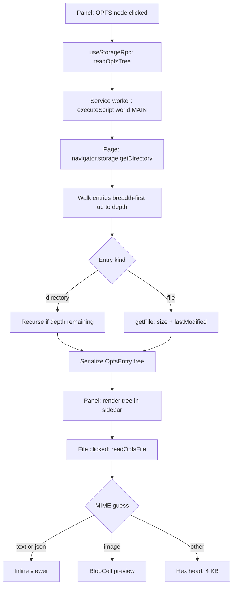
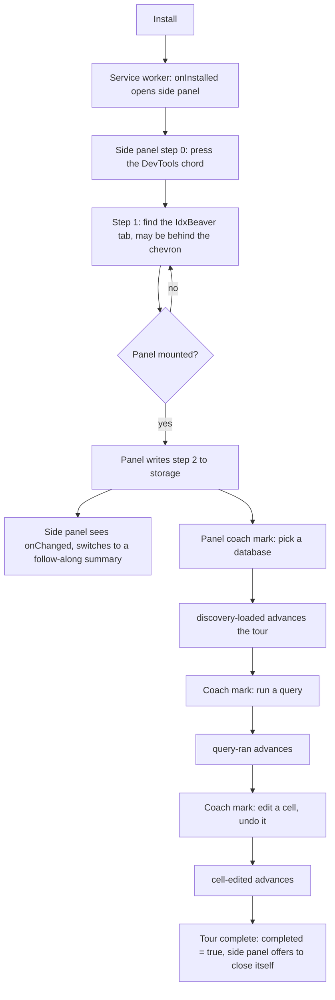

# 22 - Growth Bets (Competitor Gaps + New Surfaces)

## Context

Plans 01-21 closed the PRD gap. IdxBeaver v1.4.0 now beats every competing
IndexedDB extension on query, filters, snapshots, import/export, cookies,
cache, and virtualization. The next question is not "what is missing from the
PRD" but "what makes the install count go up".

This plan is a ranked bundle, not a single feature. Each bet below is
independently shippable and independently cancellable. Order matters: bets are
sorted by users-gained per engineering-hour, not by how interesting they are.

### Competitor audit (Sept 2026)

Four real rivals. Kahuna is the one to watch: it is the only competitor that is
also a serious product, and the only one shipping on both stores.

| Extension | Users | What it has that we don't |
|---|---|---|
| [IndexedDB Browser](https://github.com/ghazi-git/indexeddb-browser) | 340 | Reads/writes IndexedDB of **other Chrome extensions**; per-column datatype override incl. epoch-to-date; `mod+c` copy on a selected cell |
| [IndexedDB Explorer](https://chromewebstore.google.com/detail/indexeddb-explorer/lddjbjehhidgcmfcbdikhikpcgdbagmg) | 522 | "Deep search" across all databases and stores at once; Chart.js charts over store sizes |
| [IndexedDBEdit](https://chromewebstore.google.com/detail/indexeddbedit/npjecebdjnmlolggnoajngnlodhgpfac) | 6,000 | Nothing. Strictly a subset of us. |
| [Kahuna](https://github.com/hummingme/kahuna) | 1,000+ | See below. The real competitor |

#### Kahuna specifically

Chrome + Firefox, v1.6.1, 267 KB, last updated July 2026, 4.8 stars, Show HN
post behind it. Architecturally the opposite of us: **not a DevTools
extension**. It injects an overlay above the page, toggled by the toolbar icon
or `Ctrl + .`, and the toolbar badge shows the IndexedDB count for the current
origin.

What it has that we do not:

1. **No DevTools needed, plus a badge on every site.** The badge is a passive
   discovery machine: a user who never opens DevTools still sees "3" on a site
   and clicks. We are invisible until someone opens DevTools and notices a tab.
   This, not any single feature, is why it out-ranks us.
2. **Firefox.** Addressed: see Bet 1, the Firefox target now builds.
3. **Schema editing.** Create a database, add and remove object stores and
   indexes. We can delete a database or store but never create or alter one.
4. **A JavaScript console** over Dexie's API, for changes the grid cannot
   express.
5. **Dexie's own import/export format**, alongside JSON and CSV.
6. **Editing `File` and `ImageData` values.** Our `wire.ts` round-trips Blob,
   TypedArray, Map, Set, Date, RegExp, BigInt and circular refs, so this is a
   narrow gap.

Where we are ahead: the Mongo-style query language and query tabs, saved
queries and history, snapshots and diff, virtualization, Cookies and Cache
surfaces, filters with regex, SQL/NDJSON/ZIP export, undo/redo.

On the JS console (4): **deliberate non-goal for us.** Kahuna needs one because
its overlay has no console next to it. We live inside DevTools, where the user
already has a real console, a real debugger, and their app's own Dexie
instance one `await` away. Shipping a worse console next to the real one is not
a feature.

On the badge (1): we cannot have one without an `action`, which is Bet 9, and a
count would additionally need a content script or `activeTab` read on every
page. Worth revisiting after Bet 9 ships, as a follow-up to it.

Everything else on their feature lists we already ship (column hide/reorder in
`DataGrid.tsx`, shift-click multi-select at `DataGrid.tsx:330`, dark theme,
sidebar right-click destructive actions, origin-change refresh at
`main.tsx:3016`).

So parity costs us four small items (see bet 8). The rest of this plan is about
surfaces nobody has built.

## Priority order

| # | Bet | Effort | Type of win |
|---|---|---|---|
| 1 | Edge Add-ons + Firefox listings | 1-2 days | Acquisition (new stores) |
| 2 | OPFS surface | 1 week | Differentiation (no competitor, no DevTools) |
| 3 | Framework decoders | 3-4 days | Store-search keywords + activation |
| 4 | Playwright `storageState` export/import | 2 days | New audience (test engineers) |
| 5 | Live watch / auto-refresh | 2-3 days | Retention |
| 6 | Extension storage surface | 3-4 days | New audience (extension devs) |
| 8 | Competitor parity quick wins | 1 day | Review defence |
| 9 | Toolbar entry pointing at the panel | 1 day | Discovery |
| 10 | Guided tour (side panel + in-panel coach marks) | 3-4 days | Activation |
| 11 | Schema editing (create DB, add/remove stores, indexes) | 3-4 days | Parity with Kahuna |

Bets 1, 3, 4, 8, and 9 are the cheap half. If only one week exists, ship
those and stop.

Bet numbers are stable IDs. 7 was an AI natural-language query editor
(bring-your-own-key); it is deferred, see Deferred at the bottom. The number
is not reused.

---

## Bet 1 - Edge Add-ons and Firefox listings

Highest users-per-hour of anything here. Same code, no feature work.

### Edge

Edge Add-ons accepts the Chromium MV3 zip as-is. No manifest change, no fee.
`minimum_chrome_version: "120"` is ignored by Edge and harmless.

- Reuse `npm run release:zip` output verbatim.
- Reuse the listing copy from `docs/CHROME_WEB_STORE.md`; Edge asks for the
  same fields plus a "why these permissions" free-text box (answer: same text
  as the Chrome privacy-practices tab).
- Add `docs/EDGE_ADDONS.md` mirroring the Chrome guide.

### Firefox

**Done, pending a runtime pass.** `npm run release:zip:firefox` builds
`dist-firefox/` and `releases/idxbeaver-<version>-firefox.zip`, and
`web-ext lint` reports 0 errors. Full write-up in `docs/FIREFOX_ADDONS.md`.

An earlier draft of this plan claimed `world: "MAIN"` does not exist in Firefox
and sized the port around working past it. That was wrong: MAIN-world injection
landed in **Firefox 128**, so no injection rewrite is needed. The actual
differences were manifest-only:

- `background.service_worker` is unimplemented in Firefox, so the build
  re-stamps it as `background.scripts` (event page). `type: "module"` is fine
  from Firefox 112.
- `browser_specific_settings.gecko.id`, `strict_min_version: "140.0"`, and the
  now-mandatory `data_collection_permissions: { required: ["none"] }`.
- `minimum_chrome_version` and `use_dynamic_url` dropped.

Applied in `scripts/release-zip.mjs` after the build rather than in
`src/manifest.ts`, because @crxjs owns manifest emission and hashes asset names.

Still open: the manifest is verified, the runtime is not. `docs/FIREFOX_ADDONS.md`
lists what to exercise, in priority order, starting with discovery (which proves
MAIN-world injection and `func`/`args` serialization) and host-permission
revocation, which Firefox allows per site from 127 and Chrome does not.

### Files to change

- ~~`scripts/release-zip.mjs`~~ done: `--target=chrome|firefox`.
- New: `docs/EDGE_ADDONS.md`. ~~`docs/FIREFOX_ADDONS.md`~~ done.
- `src/manifest.ts` - unchanged, deliberately. The Firefox delta lives in the
  release script.

### Non-goals

- Safari. Requires an Xcode wrapper and an Apple developer account. Revisit
  only if Firefox numbers justify it.

---

## Bet 2 - OPFS surface (Origin Private File System)

The genuine moat. Chrome DevTools cannot browse OPFS. No extension can. Every
app using `sqlite-wasm`, `wa-sqlite`, DuckDB-wasm, or a wasm filesystem stores
its real database there and currently has **zero** inspection tooling.

### Scope

Read-only first cut. Write support is a separate plan.

- Tree browse of `navigator.storage.getDirectory()` recursively.
- Per-file: name, size, `lastModified`, MIME guess from extension.
- Preview: text/JSON files inline (cap 1 MB), images via a blob preview reusing
  `BlobCell` in `cells.tsx`, everything else as a hex head (first 4 KB).
- Download any file via `downloadBlob()` from `export.ts`.
- Delete a file or directory behind the existing `DestructiveDialog`.

### RPC shape

Add to the `StorageRequest` union in `src/shared/types.ts` (currently lines
162-187) and handle in `src/shared/executeStorageRequest.ts`:

```ts
| { type: "readOpfsTree"; tabId: number; frameId: number; path: string; depth: number }
| { type: "readOpfsFile"; tabId: number; frameId: number; path: string; maxBytes: number }
| { type: "deleteOpfsEntry"; tabId: number; frameId: number; path: string; recursive: boolean }
```

```ts
export interface OpfsEntry {
  path: string;              // "/db/app.sqlite3", always absolute, "/" separated
  name: string;
  kind: "file" | "directory";
  size: number | null;       // null for directories
  lastModified: number | null;
  children?: OpfsEntry[];    // present only when depth allowed a descent
}
```

### Flow



### Files to change

- `src/shared/types.ts` - the three request types, `OpfsEntry`, and a
  `{ kind: "opfs"; path: string; frameId: number }` variant on the existing
  sidebar node union (`main.tsx:80`) and tab union (`main.tsx:89`).
- `src/shared/executeStorageRequest.ts` - the walker. Must stay self-contained
  (no module-scope references) like every other handler there.
- `src/background/index.ts` - route the three new types. OPFS is per-origin and
  per-frame, so it needs the same frame fan-out `discover` already does.
- New: `src/panel/OpfsView.tsx` - tree on the left, preview on the right.
- `src/panel/main.tsx` - sidebar group "File System", node selection, tab open.
- `src/panel/OriginDashboard.tsx` - OPFS total bytes alongside the existing
  `storageEstimate` breakdown.

### Failure modes

- **OPFS unsupported** (old Chrome, some embedded webviews): the walker throws
  on `getDirectory`. Return an empty tree with a `notSupported: true` flag; the
  sidebar group hides itself rather than showing an error row.
- **Huge trees** (wasm apps write thousands of shards): hard-cap at 2000
  entries per response and paginate by directory. Default `depth: 2`, expand on
  click.
- **Locked SQLite files**: a file held by an active `sqlite-wasm` VFS handle can
  throw on `getFile()`. Catch per entry, mark `size: null`, keep walking.
- **Cross-origin frames**: same partitioning rule as IndexedDB. Tag every entry
  with its `frameId`.

### Non-goals

- Writing or uploading files into OPFS.
- Opening a `.sqlite3` from OPFS and running SQL against it. Tempting, needs a
  wasm SQLite in the panel bundle, and the 2 MB bundle cap in `00-overview.md`
  already has no headroom. Separate plan if OPFS lands well.

### Tests

- `src/shared/opfs.test.ts` (new) - pure path helpers: `joinPath`,
  `parentPath`, `guessMime(name)`, `capTree(entries, limit)`.
- Manual: any sqlite-wasm demo page, confirm the tree lists the DB file and the
  hex head renders.

---

## Bet 3 - Framework decoders

Cheap, read-side only, and each decoder is a Chrome Web Store search term real
people type ("redux persist viewer", "localforage inspector"). This is the
best keyword-per-hour item on the list.

### Targets, in order

| Decoder | Detection | What it does |
|---|---|---|
| redux-persist | LocalStorage key `persist:*` | Parse the outer JSON, then parse every value (each slice is double-encoded JSON) and render as a tree |
| localForage | IndexedDB DB `localforage`, store `keyvaluepairs` | Show key/value directly, skip the wrapper row shape |
| Dexie | Store meta table `_dexie_*` or DB has `$meta` | Label the DB "Dexie" in the sidebar and surface the declared schema in `StructureView` |
| PouchDB / CouchDB | DB name ends `_pouch` or store `by-sequence` | Group revisions, hide tombstones behind a toggle |
| Workbox | Cache names `workbox-*` | Label precache vs runtime, show the revision hash column |
| Firestore offline | DB `firestore/*` | Decode the `remoteDocuments` key path into collection/doc ids |
| JWT | any string cell matching `^ey[A-Za-z0-9_-]+\.` | Decode header + payload, show `exp` as a date and flag expired |

### Design

One pure module, no RPC changes, no new permissions:

```ts
// src/shared/decoders.ts
export interface Decoder {
  id: string;                                   // "redux-persist"
  label: string;                                // shown as a sidebar badge
  matchesDb?(db: IndexedDbDatabaseInfo): boolean;
  matchesKey?(surface: "localStorage" | "sessionStorage", key: string): boolean;
  matchesValue?(value: unknown): boolean;       // for JWT-style cell decoding
  decode(raw: unknown): { view: SerializableValue; note?: string };
}

export const DECODERS: Decoder[];
export function decodersFor(ctx: DecodeContext): Decoder[];
```

Rendering hooks in exactly two places:

- `src/panel/cells.tsx` - `renderCell()` gains a decoded branch before the
  existing `CollapseCell` fallback. Decoded cells get a small badge and a
  "show raw" toggle so nothing is ever hidden from the user.
- `src/panel/main.tsx` - sidebar db/store rows render the decoder label as a
  badge.

### Rules

- Decoders never change what is written. Editing a decoded cell edits the raw
  value; the decoded view is display-only in this plan.
- A decoder that throws is dropped silently for that value. Never let a bad
  guess break the grid.
- A single pref (`decodeKnownFormats`, default `true`) in `prefs.ts` turns the
  whole layer off.

### Tests

`src/shared/decoders.test.ts` - one fixture per decoder: raw in, decoded out,
plus a malformed input per decoder asserting the raw value survives.

---

## Bet 4 - Playwright `storageState` export/import

Test engineers search for this. The format is already 90% of what
`export.ts` / `import.ts` do, so the cost is a mapping layer.

Playwright's shape:

```json
{
  "cookies": [{ "name": "", "value": "", "domain": "", "path": "", "expires": -1,
                "httpOnly": false, "secure": false, "sameSite": "Lax" }],
  "origins": [{ "origin": "https://app.example.com",
                "localStorage": [{ "name": "", "value": "" }] }]
}
```

### Scope

- **Export**: a "Copy as Playwright storageState" action on the Origin tab.
  Sources: existing `readCookies` reply plus `readKeyValue` for localStorage.
- **Import**: accept a `storageState.json` in the existing `ImportDialog`.
  `detectFormat` in `import.ts` gains a `"storage-state"` branch (detect by
  top-level `cookies` + `origins` keys, not by filename). Applies cookies via
  `setCookie` and localStorage via `setKeyValue`.
- Playwright has no sessionStorage or IndexedDB in `storageState`. Say so in
  the UI rather than silently dropping data: the export dialog lists what is
  excluded.

### Files to change

- New: `src/shared/storageState.ts` - `toStorageState(...)` /
  `fromStorageState(...)`, pure, both directions.
- `src/shared/import.ts` - `ImportFormat` union + `detectFormat` + `parseFile`.
- `src/panel/ImportDialog.tsx` - a row for the new format.
- `src/panel/OriginDashboard.tsx` - the export action.

### Tests

`src/shared/storageState.test.ts` - round-trip a fixture with an httpOnly
cookie, a `sameSite: "None"` cookie, a session cookie (`expires: -1`), and a
localStorage entry holding a newline.

---

## Bet 5 - Live watch / auto-refresh

Nobody has it, including native DevTools. Retention feature: it turns the panel
from a thing you open into a thing you leave open.

### Approach

Polling, not observers. IndexedDB has no change events across contexts, and
building a page-side hook would mean patching `IDBObjectStore.prototype` in the
inspected page. Do not do that.

- A "Live" toggle in the data footer, off by default, per open tab.
- When on, re-issue the tab's existing read (`readIndexedDbStoreChunk` or
  `readKeyValue`) on an interval. Interval pref: 1s / 2s / 5s, default 2s.
- Diff old rows against new by key. Newly appeared keys flash green, changed
  values flash amber, removed keys flash red then drop out. Reuse the diff
  helpers already written for `DiffView.tsx`.
- Auto-suspend when: the DevTools panel is hidden
  (`chrome.devtools.panels.onHidden`), the grid has an open cell editor, or
  five consecutive polls returned identical data (back off to 10s).

### Files to change

- `src/panel/main.tsx` - the interval, suspend rules, per-tab `live` flag.
- `src/panel/DataGrid.tsx` - row highlight classes driven by a
  `changedKeys: Map<string, "added" | "changed" | "removed">` prop.
- `src/shared/prefs.ts` - `liveRefreshMs: number` added to `Prefs` and
  `DEFAULTS` (mergeWithDefaults already handles the migration for free).

### Risks

- **Cost on the inspected page.** A 2s poll over a 200k-row store is not free.
  Refuse to enable Live when the store's row count exceeds 50k; show a tooltip
  saying why. Query tabs poll their own result set, which is already capped.
- **Edit collisions.** A poll landing mid-edit must not clobber the draft.
  Suspending on open editor covers it; also skip applying a poll result if the
  undo stack changed since the request went out.

### Tests

`src/shared/liveDiff.test.ts` (new) - pure `diffRows(prev, next)` returning the
change map. Cases: add, remove, in-place value change, key reorder with no
change (must report nothing).

---

## Bet 6 - Extension storage surface

Closes the one real feature IndexedDB Browser has over us, and opens an
audience (extension developers) with no good tool at all.

Two halves, both needed for the pitch to make sense:

1. **`chrome.storage` of the inspected extension** - `local`, `sync`,
   `session`, and `managed`. This is what extension devs actually debug, and
   native DevTools shows none of it.
2. **IndexedDB on `chrome-extension://` origins** - works today only if the
   user opens DevTools on an extension page, and `host_permissions:
   ["<all_urls>"]` does not cover `chrome-extension://`.

### Permission cost, read carefully

Reading another extension's storage requires either `management` plus a
debugger attach, or the user opening DevTools on that extension's own page.
**Only build the second.** The first is a store-review rejection risk and a
legitimate security concern.

Concretely: when the inspected page's origin is `chrome-extension://<id>`, add
`chrome-extension://*/*` to `host_permissions` so injection works, and read
`chrome.storage` from inside the page world (an extension page has its own
`chrome.storage` bound to its own id). No new sensitive permission, no access
to extensions the user did not open DevTools on.

### RPC shape

```ts
| { type: "readExtensionStorage"; tabId: number; area: "local" | "sync" | "session" | "managed" }
| { type: "setExtensionStorage"; tabId: number; area: "local" | "sync" | "session"; key: string; value: SerializableValue }
| { type: "removeExtensionStorage"; tabId: number; area: "local" | "sync" | "session"; key: string }
```

`managed` is read-only by definition; reject writes to it in the handler, not
just in the UI.

### Files to change

- `src/manifest.ts` - add `chrome-extension://*/*` to `host_permissions`.
  **This changes the install-time permission prompt.** Update the
  privacy-practices answers in `docs/CHROME_WEB_STORE.md` and `docs/PRIVACY.md`
  in the same PR.
- `src/shared/types.ts`, `src/shared/executeStorageRequest.ts`,
  `src/background/index.ts` - the three request types.
- `src/panel/main.tsx` - a "Extension Storage" sidebar group, visible only when
  `discovery.origin` starts with `chrome-extension://`. Values are arbitrary
  JS, so reuse the existing KV grid plus `wire.ts` serialization rather than
  the string-only localStorage path.

### Non-goals

- Listing or reading extensions the user has not opened DevTools on.
- `chrome.storage` change events. Bet 5's polling covers it if wanted.

---

## Bet 8 - Competitor parity quick wins

One day, all four, purely so no review can say a rival does something we don't.

### 8a. Epoch timestamp columns

`inferValueType()` in `schemaInfer.ts` only ever returns `"date"` for strings.
Numeric epochs (the common `createdAt: 1757376000000`) render as raw integers.

- Add an `"epoch"` `InferredType`. Infer it when a column is integral and every
  sampled value falls in `[1e11, 4e12]` (roughly year 1973 to 2096 in ms) or
  `[1e9, 4e9]` for seconds. Store which unit was detected.
- `renderCell()` in `cells.tsx` renders it via the existing `formatDate()`,
  with the raw number in `title`.
- Per-column override in the column header menu, persisted per store, so the
  heuristic is never a trap: `epoch ms | epoch s | number`.

The unit heuristic is the load-bearing part. Test it: `1e9` boundary values,
a column of small integers that must stay numbers, and a mixed column.

### 8b. Global search across all databases and stores

Explorer's "deep search". We have per-store filters and per-store queries, no
cross-store find.

- Extend the existing `CommandPalette.tsx` with a second mode
  (`>` for commands, plain text for navigation, `?` for value search) rather
  than building a new surface.
- New RPC `{ type: "searchAllStores"; tabId: number; frameId: number; needle: string; limit: number }`.
  Handler walks every store with a cursor, stringifies each value once, and
  substring-matches. Cap: 200 hits, 5s wall clock, then return partial with
  `truncated: true`.
- Result rows are "db / store / key", clicking one opens that store scrolled to
  that key.

This is the one parity item with real cost, because a naive full scan on a big
origin will hang the page. The cap and the timeout are not optional.

### 8c. `mod+c` copy in the grid

Copy JSON exists only in the inspector pane (`main.tsx:2140`). Add to
`DataGrid.tsx`: `mod+c` copies the focused cell as text, or the selected rows
as NDJSON when a multi-row selection is active (`toNdjson()` from `export.ts`
already does the formatting). Add the shortcut to `shortcuts.ts` and the README
table.

### 8d. Dexie import/export format

Kahuna reads and writes Dexie's own export format (what `dexie-export-import`
produces). Dexie is the most-used IndexedDB wrapper, so this is the format
people already have on disk. `import.ts` gains a `"dexie"` branch detected by
the `formatName: "dexie"` field in the envelope, and `export.ts` gains the
writer. Pure logic, tested like the other formats.

### 8e. Alt+S reload

`alt+s` re-reads the visible store. Trivial, and it is on their list.

---

## Bet 9 - Toolbar entry that points at the DevTools panel

The DevTools panel stays the product. This bet is only about the dead click.

Today `src/manifest.ts` declares `devtools_page` and nothing else: no `action`,
no `popup`. Chrome still puts an IdxBeaver icon in the toolbar after install,
the user clicks it, nothing happens, and they never learn the panel exists.
That is the whole problem being solved here.

### The hard constraint, write it down

**Chrome has no API to open DevTools, and none to focus a specific DevTools
panel.** Not `chrome.action`, not `chrome.devtools`, not `chrome.debugger`
(which attaches a debugger session without opening the UI). So a toolbar click
cannot take the user to our panel. It can only *tell them how to get there*.

Every design below follows from that. Anyone who revisits this bet expecting a
one-click launcher should stop here.

### Scope

- `action` with a `default_popup` pointing at a new `popup.html`.
- The popup is a signpost, roughly 200x300, and contains:
  - The per-OS shortcut, detected from `navigator.userAgent`: "Press ⌥⌘I then
    pick the IdxBeaver tab" on Mac, "Press F12 then pick the IdxBeaver tab"
    elsewhere.
  - A one-line note that the panel may sit behind the `»` overflow chevron in
    the DevTools tab strip on narrow windows. This is the single most common
    reason a user concludes the extension is broken.
  - Links out: docs, `https://github.com/adityaongit/idxbeaver/issues`,
    changelog.
- An onboarding page on first install: `chrome.runtime.onInstalled` with
  `reason === "install"` opens a single tab explaining the same thing, once.
  Catching the user at install is worth more than catching them at first click.

### Keep the popup dumb

Plain HTML plus a few lines of inline script. **Do not mount the React panel
root in it** and do not reuse `SettingsPage.tsx` there. The popup would pull in
the panel chunk (~640 KB) to render four links, and the 2 MB zipped cap in
`00-overview.md` has no headroom. Settings stay in the panel where they are.

### Files to change

- New: `popup.html` at repo root, next to `panel.html` and `devtools.html`.
- `vite.config.ts` - add `popup: resolve(__dirname, "popup.html")` to
  `build.rollupOptions.input`.
- `src/manifest.ts` - `action: { default_popup: "popup.html", default_title:
  "IdxBeaver" }`.
- `src/background/index.ts` - the `onInstalled` handler.
- `docs/CHROME_WEB_STORE.md` - the listing description should say "adds a panel
  to DevTools" in the first sentence, for the same reason.

No new permission. No change to the install prompt. No listing re-review.

### Non-goals

- A standalone or side panel copy of the UI. DevTools is the home; a second
  host means a second set of behaviours to keep in sync. See Deferred.
- Any attempt to auto-open DevTools. Not possible, see the constraint above.
- Settings, data, or grids in the popup.

### Tests

`src/shared/shortcutHint.test.ts` (new) - `devtoolsHint(userAgent)` returns the
Mac chord for a Mac UA and `F12` otherwise. That is the only logic here; the
rest is static markup and one listener.

---

## Bet 10 - Guided tour across the side panel and the panel

This is the one job a side panel is genuinely better at than DevTools, and it
is not a second data UI. The side panel teaches; the DevTools panel stays the
product.

### Why a side panel earns its place here

At the moment a new user needs teaching most, our panel does not exist yet.
They have installed the extension, DevTools is closed, and there is nowhere for
us to put a word. Bet 9's popup covers that with static text, but a popup
closes the instant they click anything, which is exactly what we are asking
them to do. A side panel stays open while they follow the steps.

### The limitation that shapes the design

A side panel **cannot see or draw on DevTools**. It cannot highlight our tab in
the DevTools tab strip, cannot detect whether DevTools is open, and cannot tell
what the user clicked inside our panel. Anything it says about the panel is
prose in a different window.

So split the tour by which host can actually do the job:

| Phase | Host | Why there |
|---|---|---|
| 0-2: open DevTools, find the IdxBeaver tab, pick a database | Side panel | The panel does not exist yet, so nothing else can talk to the user |
| 3+: run a query, edit a cell, take a snapshot, export | DevTools panel, as coach marks anchored to real elements | Only the panel can point at its own buttons |

The two halves are one tour because they share progress state.

### Shared progress state

Both hosts are extension pages, so neither needs page injection or a new RPC.
They talk through `chrome.storage.local` plus `chrome.storage.onChanged`.

```ts
// src/shared/tour.ts
export interface TourState {
  version: 1;
  step: number;            // index into STEPS
  completed: boolean;
  dismissedAt: number | null;
  seenSteps: number[];     // so a re-run can skip what they already did
}

export interface TourStep {
  id: string;              // "open-devtools", "pick-database", "run-query"
  host: "sidepanel" | "panel";
  title: string;
  body: string;
  anchor?: string;         // data-tour value on the target element, panel steps only
  // Advance when this fires. Panel steps advance on real user action, never on a timer.
  advanceOn: "manual" | "discovery-loaded" | "store-opened" | "query-ran" | "cell-edited";
}

export const STEPS: TourStep[];
export async function getTour(): Promise<TourState>;
export async function advanceTour(trigger: TourStep["advanceOn"]): Promise<TourState>;
```

Key rule: **panel steps advance on real events, not on a "Next" button.** The
panel already knows when `discover` resolved, when a store tab opened, when
`runQuery()` returned, and when the undo stack grew. Wire `advanceTour()` into
those existing call sites. A tour that ticks itself off as the user actually
does the thing is the difference between teaching and nagging.

### Flow



### Scope

- 6 steps maximum, two in the side panel and four in the panel. A tour longer
  than that gets dismissed rather than finished.
- Skippable at every step, and **never** shown twice unless the user asks. A
  "Replay tour" item in the command palette and in Settings.
- Coach marks anchored by a `data-tour="..."` attribute on existing elements in
  `main.tsx`. No layout changes, no wrapper components. A step whose anchor is
  missing from the DOM is skipped silently, so the tour can never block the UI
  after a refactor moves something.
- The side panel's follow-along view is read-only text plus a progress list. No
  grids, no settings, no data.

### Files to change

- New: `sidepanel.html` at repo root, plus `src/sidepanel/main.tsx`. Small own
  React root, or plain DOM if it stays this simple. **Must not import the panel
  root** (see Bundle budget).
- New: `src/shared/tour.ts` - `STEPS`, state read/write, `advanceTour()`.
- New: `src/panel/TourCoachMark.tsx` - one absolutely-positioned bubble that
  resolves `anchor` via `document.querySelector('[data-tour="..."]')` and
  repositions on scroll and resize.
- `vite.config.ts` - `sidepanel` entry in `build.rollupOptions.input`.
- `src/manifest.ts` - `side_panel: { default_path: "sidepanel.html" }` and
  `permissions: [..., "sidePanel"]`. **Not `tabs`**: the tour never needs the
  active tab's URL, and `tabs` is what would add a browsing-history warning to
  the install prompt.
- `src/background/index.ts` - on install, open the side panel and seed
  `TourState`.
- `src/panel/main.tsx` - `data-tour` attributes on the database picker, the
  query editor, the run control, and a grid cell; `advanceTour()` calls at the
  four existing event sites; render `TourCoachMark` when a panel-host step is
  active.
- `src/panel/CommandPalette.tsx`, `src/panel/SettingsPage.tsx` - "Replay tour".

### Interaction with Bet 9

Overlapping, so pick one and do not build both: if this bet ships, Bet 9's
install-time onboarding **tab** is replaced by the side panel opening instead.
Bet 9's popup still earns its keep as the answer to "where did it go" on the
hundredth day, long after the tour is done.

### Failure modes

- **User never opens DevTools.** The tour parks on step 0 forever. That is the
  correct behaviour, but do not nag: no repeated side-panel reopening, no
  badge. One shot at install.
- **Side panel closed mid-tour.** Progress is in storage, so the panel half
  continues on its own. The tour must be coherent from the panel alone.
- **DevTools opened before the side panel** (returning user replaying the
  tour): start at step 2 rather than telling someone already in the panel how
  to open the panel.
- **Anchor missing** after a UI refactor: skip the step. Covered by a test.
- **Two DevTools windows** on different tabs, both writing tour state: last
  write wins, and the tour is idempotent per step because `seenSteps` is a set.

### Non-goals

- Any data browsing, querying, or editing in the side panel. That is the line
  this bet must not cross. If the side panel ever grows a grid, everything in
  the Deferred note about two hosts to keep in sync applies again.
- Video, animation, or an interactive sandbox. Text and one bubble.
- Tours for individual features (snapshots, decoders). If those need
  explaining, they need better UI, not a tour.

### Tests

`src/shared/tour.test.ts` (new):

- `advanceTour` moves only on a matching trigger and is idempotent when the
  same trigger fires twice.
- `getTour` on a missing or corrupt storage value returns a fresh state rather
  than throwing.
- A step whose `anchor` resolves to nothing is reported as skippable.
- `completed: true` state does not re-enter the tour on the next panel mount.

---

## Bet 11 - Schema editing

The one Kahuna feature we lack that is not a philosophical choice. Today we can
delete a database or an object store; we cannot create or alter one.

### Scope

- Create a database (name + version).
- Add or remove an object store, with key path and `autoIncrement`.
- Add or remove an index, with `unique` and `multiEntry`.

### Why it is more than a form

Every one of these is only legal inside a `versionchange` transaction, which
means closing the database, reopening it at `version + 1`, mutating in
`onupgradeneeded`, and dealing with the fact that **the inspected page still
holds its own connection**. If the page does not respond to `onversionchange`
by closing, the upgrade blocks forever.

So the flow needs, in `executeStorageRequest`:

1. Open at `version + 1` and register `onblocked` before anything else.
2. If `onblocked` fires, fail fast with a clear message: "the page is holding
   this database open, reload it and retry". Do not hang and do not force it.
3. Mutate in `onupgradeneeded`, close, and report the new version so the panel
   can re-discover.

Removing a store or an index **destroys data**, so both route through the
existing `DestructiveDialog` typed confirmation.

### RPC shape

```ts
| { type: "createIndexedDbDatabase"; tabId: number; frameId: number; dbName: string;
    stores: Array<{ name: string; keyPath: string | string[] | null; autoIncrement: boolean }> }
| { type: "alterIndexedDbSchema"; tabId: number; frameId: number; dbName: string; dbVersion: number;
    ops: SchemaOp[] }

type SchemaOp =
  | { op: "createStore"; name: string; keyPath: string | string[] | null; autoIncrement: boolean }
  | { op: "deleteStore"; name: string }
  | { op: "createIndex"; store: string; name: string; keyPath: string | string[]; unique: boolean; multiEntry: boolean }
  | { op: "deleteIndex"; store: string; name: string };
```

Batch the ops in one `versionchange` rather than one version bump per change.
Five separate bumps is five chances for the page to block.

### Files to change

- `src/shared/types.ts`, `src/shared/executeStorageRequest.ts`,
  `src/background/index.ts` - the two request types.
- `src/panel/StructureView.tsx` - it already renders key path and indexes; add
  the edit affordances there rather than building a new dialog.
- `src/panel/main.tsx` - "New database" in the sidebar, re-discover after any
  successful schema change.

### Non-goals

- Renaming a store or index. IndexedDB has no rename; it is create, copy, drop,
  and that is a data migration, not a schema edit. Out of scope.
- Changing a key path on an existing store. Same reason.
- Any schema change while a query is mid-flight. Block the UI on it; these are
  rare, deliberate operations.

### Tests

`src/shared/schemaOps.test.ts` (new) - `planUpgrade(current, ops)` returns the
target version and rejects contradictory op sets (create then delete the same
store, duplicate index names, an index on a store not present after the ops).
The IDB side needs a manual check against a page holding an open connection,
which is the failure mode that matters.

---

## Sequencing

- **Sprint 1 (cheap half):** Bet 1 Edge, Bet 8, Bet 9, Bet 4, Bet 3.
- **Sprint 2 (the moat):** Bet 2 OPFS, Bet 11 Schema editing.
- **Sprint 3:** Bet 5 Live watch, Bet 10 Guided tour.
- **Sprint 4:** Bet 6 Extension storage.

Bet 6 is the only bet that widens `host_permissions`, so it is the only one
that clearly re-opens the store listing's privacy answers. Bet 10 adds the
`sidePanel` permission, which should carry no user-facing warning; confirm that
against a real unlisted upload rather than trusting it.

## Bundle budget

`00-overview.md` flags a 2 MB zipped cap with the panel already at ~640 KB.
Running total of this plan: the OPFS view is the only new UI of any size;
decoders and storageState are pure logic. Bet 9's popup and Bet 10's side panel
are both small standalone entries and neither may import the panel chunk; a
`sidepanel.html` that pulls in `src/panel/main.tsx` would double the shipped
bundle to render six paragraphs of text. No new runtime dependency is
proposed anywhere in this document, and none should be added without checking
the zipped size first.

## Open questions

- Bet 2: is read-only OPFS enough to be worth a store-listing headline, or does
  the pitch need writes? Read-only is what this plan sizes.
- Bet 6: confirm that `chrome-extension://*/*` in `host_permissions` does not
  trigger a scarier install prompt than `<all_urls>` already does. Check
  against a real unlisted upload before committing to it.
- Bet 9: is the install-time onboarding tab worth the mild annoyance? It is the
  highest-leverage half of the bet and also the easiest to resent. Ship the
  popup first, measure, then decide. Moot if Bet 10 ships, which opens the side
  panel instead.
- Bet 9 follow-up: Kahuna's toolbar badge showing the per-origin database count
  is its best discovery mechanism. Costing it out needs a decision on reading
  IndexedDB on every page load, which is a real privacy and performance
  question, not just an API question. Revisit once Bet 9 has shipped an
  `action`.
- Bet 10: does the side panel plus a docked DevTools leave the page usable, or
  is the screen too crowded to follow a tour in? Try it before writing the
  steps; if it is cramped, the whole tour collapses into the panel half and the
  side panel is dropped.

## Deferred

- **Bet 7 - AI natural-language query (BYOK).** Cut from this plan. The reason
  it was ranked low still holds: asking for an API key minutes after install
  converts badly, so it would have lifted activation for existing users without
  moving install count, while flipping the store listing's data-use disclosure
  because schema leaves the device. Revisit only once bets 1-6 have landed and
  there is a reason to believe users would supply a key. If it comes back, the
  shape is: schema-only prompt built from `inferSchema()`, generate into the
  existing editor, never auto-run, reads only, key stored outside `prefs.v1`.

- **Standalone / side panel as a data UI.** Considered and dropped: the
  DevTools panel is deliberately the only place data is browsed or edited. Bet
  10 uses a side panel strictly to teach, which is why it does not fall foul of
  this. A `side_panel` copy would need `sidePanel` and
  `tabs` permissions (widening the install prompt) and, more to the point, four
  module-scope DevTools assumptions in `src/panel/main.tsx` would have to become
  dynamic: the `extensionRuntime` gate (`:100`), the `const tabId` module
  constant (`:103`, would become a context resolved from `tabs.query` and
  re-resolved on tab switch), the theme read from `devtools.panels.themeName`
  (`:299`), and re-discovery on `devtools.network.onNavigated` (`:3016`). The
  `inspectedWindow.eval` fallback (`:2954-3009`) has no equivalent outside
  DevTools at all. Two hosts also means two sets of behaviour to keep in sync
  forever. Revisit only if users actually ask for a non-DevTools surface.
